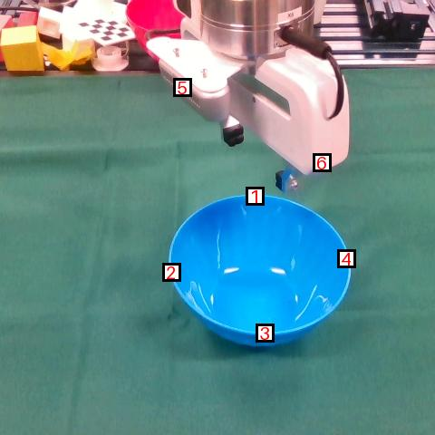
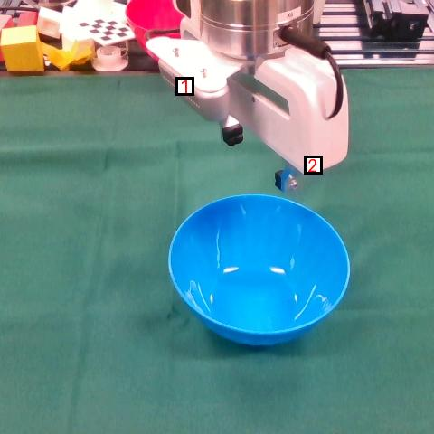

# Multi-object Keypoint Annotator
PyQt-based Image/Video multi-object key-point annotator

## Features
1. Support keypoints labelling for multiple objects
2. Custom naming: Prompt for custom object name to save in JSON (name should be unique and non-empty)
3. Mode Switch: Mode 1 (multiple objects on single image) and Mode 2 (multiple objects on separate images)
4. Clear annoation: clear current object annotation in case of wrong labelling

## Sample Annotations
### Multiple objects on a single image


### Multiple objects on separate images



### Saved JSON
```json
{
    "bowl": {
        "keypoints": [
            [
                287,
                190
            ],
            [
                291,
                386
            ],
            [
                360,
                301
            ],
            [
                217,
                284
            ]
        ],
        "no_keypoints": 4
    },
    "arm": {
        "keypoints": [
            [
                95,
                204
            ],
            [
                182,
                346
            ]
        ],
        "no_keypoints": 2
    }
}
